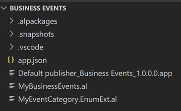
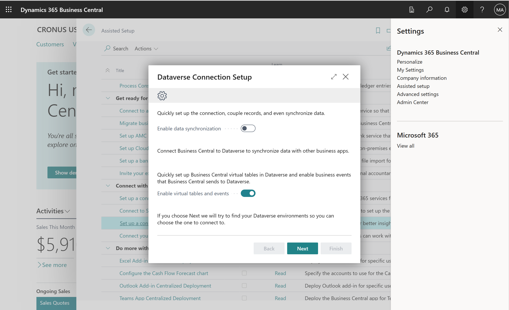
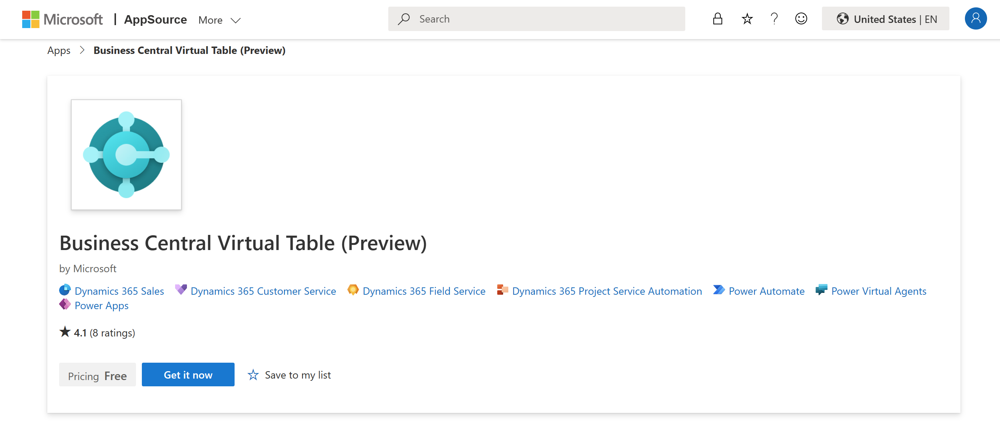
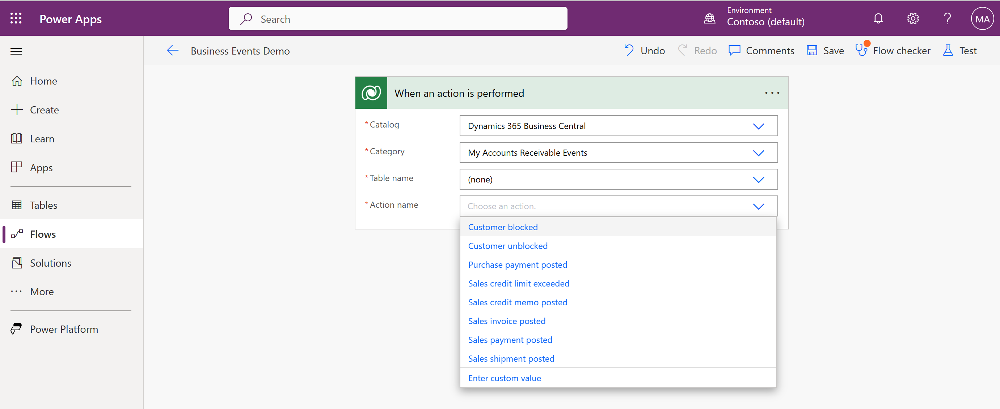

# Business Events on Business Central (Preview)

## Introducing business events
Integrating w/ Dataverse enables Business Central to interact w/ other apps in its ecosystem.  There are four types of *complementary* interactions: Data Sync, virtual tables, data change (**C**reated/**U**pdated/**D**eleted) events, and business events.


To review Business Central & Dataverse integration, see https://github.com/microsoft/d365bcdv/blob/main/Review%20of%20Business%20Central%20and%20Dataverse%20integration.pdf

This article highlights the new feature of business events on Business Central for notifying/triggering external Dataverse/non-Dataverse systems, the prerequisites and step-by-step instructions to preview it, as well as its current limitations/future improvements.


## Prerequisites and step-by-step instructions
To preview the new feature of business events on Business Central, you can/should:
1. Create/upgrade a Business Central environment with the new *Dynamics 365 Business Central 2023 Wave 1 Release* (**22.0**).
1. Fill out our survey: https://forms.office.com/r/GkvB6pritG.  Let us know which sample/custom business events you’ll try/build in private preview, which additional business events we should add for public preview, in which scenarios do you want to use these business events, your *Azure Active Directory tenant ID + Business Central environment name* for us to enable for private preview, and your email contact for us to follow up.
1. Explore our GitHub repository: https://github.com/microsoft/d365bcdv, which is being prepared as a one-stop-shop for Business Central & Dataverse integration, and collect source files for building an extension that implements our *Dynamics 365 Business Central* catalog of sample business events.
1. Build and install the extension on your Business Central environment that we’ve enabled for private preview.
1. On Business Central app, use the assisted setup to connect your Business Central environment to a Dataverse environment, on which you want to submit subscriptions and receive notifications of business events.  This will guide you to install the *Business Central Virtual Table (Preview)* plugin from AppSource that enables business event subscriptions/notifications on your Dataverse environment.  Make sure that you install the latest version that supports business events (**1.023093.3 or higher**).
1. On Power Apps maker portal, find and edit the **Business Central Virtual Data Source Configuration** table to refresh Business Central catalog with sample business events on your Dataverse environment.
1. On Power Apps maker portal, create Power Automate flows with the **When an action is performed** trigger that query Business Central catalog, submit subscriptions, and receive notifications of sample business events on your Dataverse environment.
1. (OPTIONAL) Following our code, build and install your own extension that adds custom business events to Business Central catalog.  Use the same **Business Central Virtual Data Source Configuration** table to refresh Business Central catalog with custom business events on your Dataverse environment.
1. (OPTIONAL) Query Business Central catalog, submit subscriptions, and receive notifications of sample/custom business events on your non-Dataverse environment.
1. Submit feedbacks/questions/issues from your preview to us. 

## Build and install an extension for sample business events
You can easily build and install an extension that implements the following sample business events for private preview:

| **Category** | **Name** | **Description** |
|--------------|----------|-----------------|
| My Accounts Payable Events | Purchase invoice posted | This business event is triggered when a vendor invoice is posted as part of the Procure-to-Pay process. |
| My Accounts Payable Events | Purchase payment posted | This business event is triggered when a vendor payment is posted as part of the Procure-to-Pay process. |
| My Accounts Payable Events | Purchase receipt posted | This business event is triggered when goods from a purchase order are received by the internal warehouse/external logistics company. This can trigger Finance Department to post a purchase invoice. |
| My Accounts Receivable Events | Customer blocked | This business event is triggered when a customer is blocked for shipping/invoicing. |
| My Accounts Receivable Events | Customer unblocked | This business event is triggered when a customer is unblocked for shipping/invoicing. |
| My Accounts Receivable Events | Sales credit limit exceeded | This business event is triggered when the credit limit for a customer is exceeded due to a posted sales invoice/changed credit limit for that customer. |
| My Accounts Receivable Events | Sales credit memo posted | This business event is triggered when a sales credit memo is posted. |
| My Accounts Receivable Events | Sales invoice posted | This business event is triggered when a sales invoice is posted as part of the Quote-to-Cash process. |
| My Accounts Receivable Events | Sales payment posted | This business event is triggered when a customer payment is posted as part of the Quote-to-Cash process. |
| My Accounts Receivable Events | Sales shipment posted | This business event is triggered when goods from a sales order are shipped by the internal warehouse/external logistics company. This can trigger Finance Department to post a sales invoice. |
| My Purchasing Events | Purchase order released | This business event is triggered when a purchase order is released to the internal warehouse/external logistics company, so they're ready to receive goods coming their way. This trigger occurs when the Release button is clicked on Purchase Order page in Business Central. |
| My Sales Events | Sales order released | This business event is triggered when a sales order is released to the internal warehouse/external logistics company, so they're ready to pick and ship goods. This trigger occurs when the Release button is clicked on Sales Order page in Business Central. |

To build and install an extension that implements those sample business events for private preview, follow these steps:
1. Collect two AL files (*MyEventCategory.EnumExt.al* and *MyBusinessEvents.al*) from this folder.
1. Build an extension by adding those files to your AL project in Visual Studio Code, see https://learn.microsoft.com/dynamics365/business-central/dev-itpro/developer/devenv-dev-overview.

   
   
1. Install the extension on your Business Central environment that we’ve enabled for private preview, see https://learn.microsoft.com/dynamics365/business-central/ui-extensions-install-uninstall.

## Connect Business Central to Dataverse 
To connect your Business Central environment to a Dataverse environment, on which you want to submit subscriptions and receive notifications of business events, follow these steps:
1.	On Business Central app, select the **Settings** icon, select the **Assisted setup** item, and then select the **Set up a connection to Dataverse** item to open the **Dataverse Connection Setup** dialog.  
1.	On that dialog, flip the **Enable virtual tables and events** switch on and select the **Next** button.

   

1.	Review the relevant terms and conditions, flip the **I accept** switch on, and select the **Next** button again.
1.	Specify your Dataverse environment URL, sign in as an administrator user, and select the **Next** button again.
1.	Install the *Business Central Virtual Table (Preview)* plugin from AppSource that enables business event subscriptions/notifications on your Dataverse environment, make sure that you install the latest version that supports business events (**1.023093.3 or higher**), and finally select the **Finish** button.

   

## Refresh Business Central catalog of business events
To refresh our business event catalog after installing your extension, follow these steps:
1.	On Power Apps maker portal, select the **Tables** section, search for the **Business Central Virtual Data Source Configuration** table under the **All** tab, and select it.
1.	Select the **Edit** button, select the **Business Central** row, and select the **Edit row using form** button to open a form.
1.	Select the **Refresh Business Event Catalog** button on that form.

   

## Query Business Central catalog, submit subscriptions, and receive notifications of business events on Dataverse 
To query Business Central catalog, submit subscriptions, and receive notifications of business events on your Dataverse environment, follow these steps:
1.	On Power Apps maker portal, create Power Automate flows with the **When an action is performed** trigger.
1.	Select the *Dynamics 365 Business Central* catalog, select one of the categories, such as *My Accounts Receivable Events*, select *(none)* as table name, and select one of the business events to subscribe in that category, such as *Customer blocked*, as action name.
1.	Select the **+ New step** button to continue your flows to process the received notifications.

   

## Build and install an extension for custom business events
To build and install an extension that implements custom business events, follow these steps:
1.	In relevant files, create a procedure with empty body.
1.	Add the *ExternalBusinessEvent* attribute to define the business event name, display name, description, and category.
1.	Add the optional *RequiredPermissions* attribute to enforce additional permissions for users to subscribe to this business event.
1.	Add the required parameters to define the business event payload.
1.	Build an extension by adding those files to your AL project in Visual Studio Code, see https://learn.microsoft.com/dynamics365/business-central/dev-itpro/developer/devenv-dev-overview.
1.	Install the extension on your Business Central environment that we’ve enabled for private preview, see https://learn.microsoft.com/dynamics365/business-central/ui-extensions-install-uninstall.
1. Use the **Business Central Virtual Data Source Configuration** table to refresh Business Central catalog with custom business events on your Dataverse environment (see above).

```al
enumextension 50101 MyEnumExtension extends EventCategory
{
    value(0; "Sales")
    {
    }
}

codeunit 50102 MyCodeunit 
{ 
    trigger OnRun()
    begin
    end; 

    [EventSubscriber(ObjectType::Page, Page::"Sales Order", 'OnPostDocumentBeforeNavigateAfterPosting', '', true, true)] 
    local procedure OnPostDocument(var SalesHeader: Record "Sales Header"; var PostingCodeunitID: Integer; var Navigate: Enum "Navigate After Posting"; DocumentIsPosted: Boolean; var IsHandled: Boolean) 
    begin
    SalesOrderPosted(SalesHeader.SystemId, SalesHeader."Sell-to Customer Name", SalesHeader."No."); 
    end;
    
    [ExternalBusinessEvent('salesorderposted', 'Sales order posted', 'Triggered when sales order has been posted', EventCategory::"Sales")]
    [RequiredPermissions(PermissionObjectType::TableData, Database::"Sales Header", 'R')] // optional
    procedure SalesOrderPosted(salesOrderId: Guid; customerName: Text; orderNumber: Text)
    begin
    end;
} 
```

## Query Business Central catalog, submit subscriptions, and receive notifications of business events on non-Dataverse systems
Business Central exposes specific APIs for business events that can be used to:
- Query business event definitions
- Add/remove business event subscriptions w/ your own webhook/notification URL

The *Business Central Virtual Table (Preview)* plugin uses the same APIs to query Business Central catalog and manage subscriptions of business events for Power Automate flows.

To query business event definitions, you can use the *externalbusinessdefinitions* endpoint:

```code
Request: GET api/microsoft/runtime/v1.0/externalbusinesseventdefinitions

Response:
```
```yaml
"value": [{
    "category": "Sales",
    "name": "salesorderposted",
    "displayName": "Sales order posted",
    "description": "Triggered when sales order has been posted",
    "payload": "[{\"Index\":0,\"Name\":\"salesOrderId\",\"Type\":\"Guid\"},{\"Index\":1,\"Name\":\"customerName\",\"Type\":\"Text\"},{\"Index\":2,\"Name\":\"orderNumber\",\"Type\":\"Text\"}]",
    "appId": "xxxxxxxx-xxxx-xxxx-xxxx-xxxxxxxxxxxx",
    "appName": "MyBCExtension",
    "appVersion": "1.0.0.0",
    "appPublisher": "Default publisher"
}]
```
