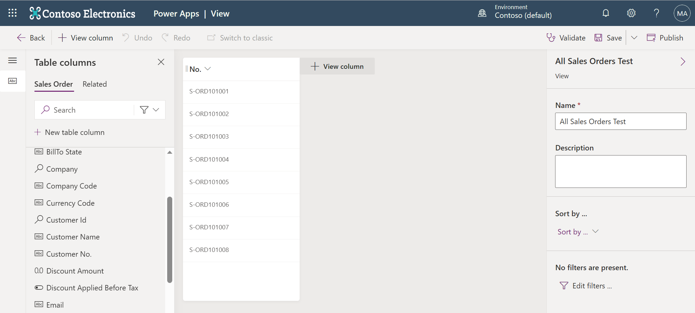
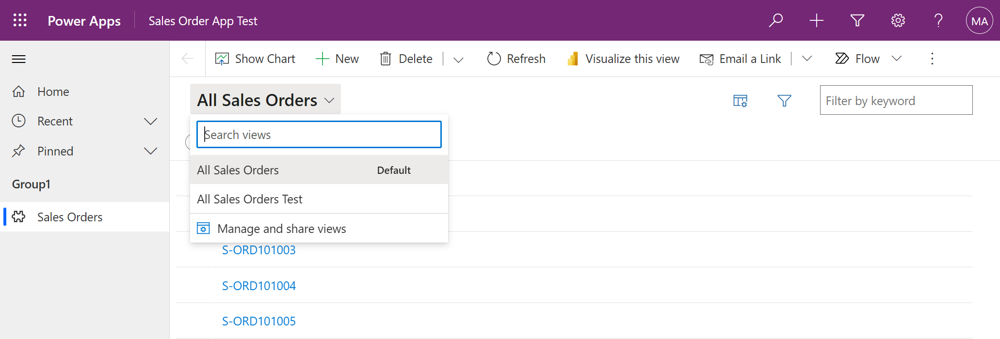
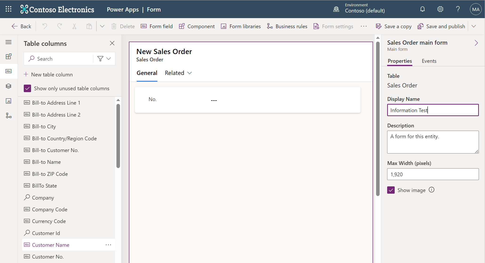
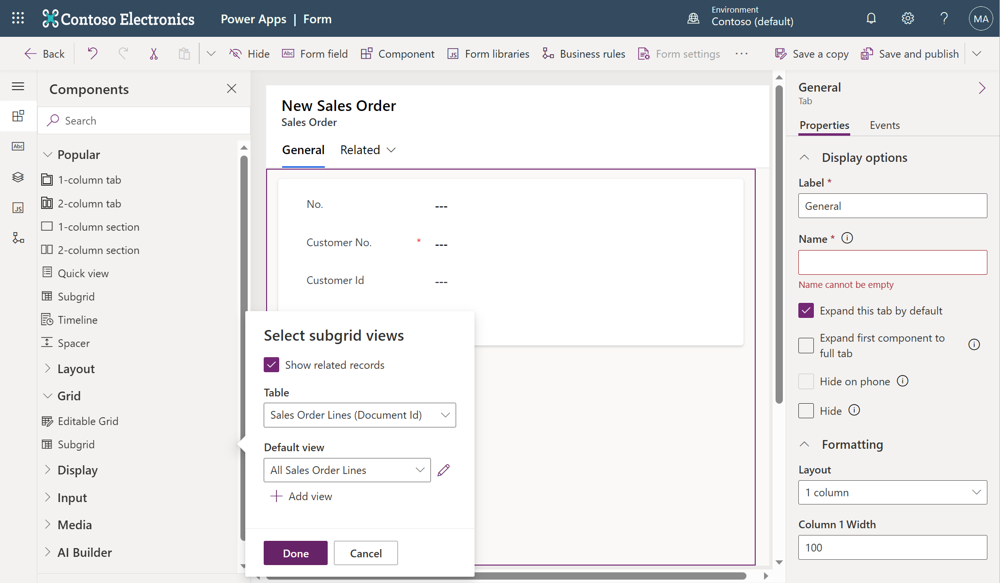
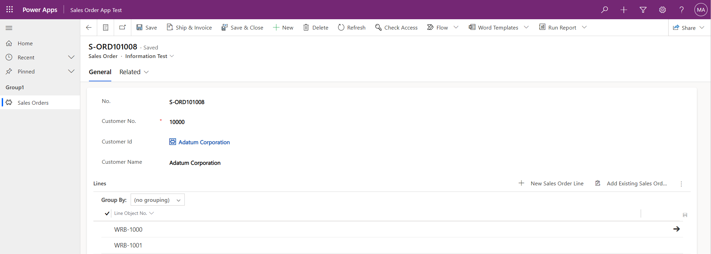
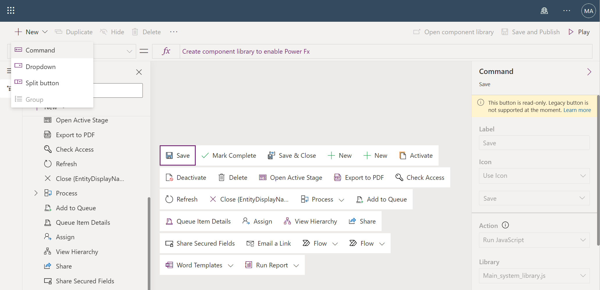
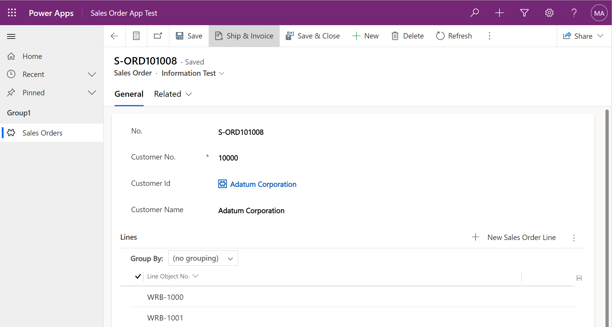

# Virtual Table Workshop

## Introduction
Integrating w/ Dataverse enables Business Central to interact w/ other apps in its ecosystem, see [a review of Business Central & Dataverse integration](https://github.com/microsoft/d365bcdv/blob/main/Review%20of%20Business%20Central%20and%20Dataverse%20integration.pdf).  There are four types of complementary app/system interactions: Data Sync that replicates data between Business Central & Dataverse, virtual tables on Dataverse via Business Central API for (**C**reate/**R**ead/**U**pdate/**D**elete) operations, data change (**CUD**) events, and business events.

This workshop focuses on those interactions enabled by our virtual table plugin that’s installed on Dataverse: virtual tables, data (CUD) events, and business events.

## Workshop environments & user accounts
For this workshop preparation, we’ve done the following:
-	Provisioned a few pairs of Business Central & Dataverse environments
-	Run the assisted setup on Business Central app to connect the paired environments
-	Installed our virtual table plugin from AppSource on all Dataverse environments
-	Generated a few virtual tables (*Customer/Item/Sales Order/Sales Order Lines*) to make them visible on all Dataverse environments
-	Created several user accounts to perform exercises on the paired environments that are accessible to them

To avoid conflicts when performing exercises, each user account has a dedicated company on its Business Central environment.  For example, the user *AdeleV@M365xXXXXXXXX.OnMicrosoft.com* has been assigned the *SUPER* permission set to access her dedicated *Cronus ADELEV* company.  To access the pre-generated/visible virtual tables, each user account has been assigned the *System Customizer* security role on its Dataverse environment.

To reserve your user account, enter your name next to one of the accounts that are still available on our reservation sheet and take note of the same password for all accounts.

Use your reserved user account, preferably in a dedicated browser profile/incognito browser mode, to access the [base app on your Business Central environment](https://businesscentral.dynamics.com/) & [Power Apps maker portal on your Dataverse environment](https://make.powerapps.com/), so you can perform the following exercises.

## Create model-driven Power Apps w/ virtual tables
In this exercise, you’ll learn to create model-driven Power Apps that can view, create, and modify sales orders in the virtual *Sales Order* table.  You’ll also learn to customize them w/ custom views/forms, Editable Grid control, and bound actions.  To perform this exercise, follow these steps:
1.	On Power Apps maker portal, select the **Apps** section, **+ New app** dropdown menu, and **Model-driven** item.

   

2.	Enter your unique app name, such as *Sales Order App YourAlias*, and select the **Create** button.
3.	Select the **+ Add page** button, **Dataverse table** radio button, and **Next** button.

   

4.	Select the **Select existing table** radio button, search for the **Sales Order** check box to check, and select the **Add** button.

   
 
5.	Select the **Publish** button.

### Customize model-driven Power Apps w/ custom views
To customize model-driven Power Apps w/ custom views, follow these steps:
1.	On Power Apps maker portal, select the **Tables** section and search for the **Sales Order** table under the **All** tab to select.

   
 
2.	Select the **Views** section and **+ New view** button.
3.	Enter your unique view name, such as *All Sales Orders YourAlias*, and select the **Create** button to open Power Apps view designer.
4.	Select the **+ View column** button to add more columns to your view.

   

5.	Select the **Publish** button.
6.	On Power Apps maker portal, select the **Apps** section and your *Sales Order App YourAlias* app.
7.	Select the **All Sales Orders** dropdown menu and your *All Sales Orders YourAlias* view or the **Manage and share views** item to change your default view.

   

### Customize model-driven Power Apps w/ custom forms
To customize model-driven Power Apps w/ custom forms, follow these steps:
1.	On Power Apps maker portal, select the **Tables** section and search for the **Sales Order** table under the **All** tab to select.

   

2.	Select the **Forms** section, **+ New form** dropdown menu, and **+ Main Form** item to open Power Apps form designer.
3.	For the **Display Name** property, enter your unique form name, such as *Information YourAlias*, and select table columns to add as fields in your form.

   

4.	Select the **Component** button, **Grid** dropdown menu, **Subgrid** item, **Show related records** check box, and **Done** button.

   

5.	For the **Label** property, enter your descriptive subgrid name, such as *Lines*, and select the **Save and publish** button.
6.	Select the **Form settings** button and **Form order** section, reorder the list of forms w/ your *Information YourAlias* form on top, and select the **Save and publish** button.

   

7.	On Power Apps maker portal, select the **Apps** section and your *Sales Order App YourAlias* app.
8.	Select any sales order to be viewed in your *Information YourAlias* form w/ its lines subgrid.
9.	On Power Apps form designer, select your subgrid, **Components** dropdown menu, **+ Component** button, **Editable Grid** item, and **Done** button.

   

10. Select the **Save and publish** button.
11. On Power Apps maker portal, select the **Apps** section and your *Sales Order App YourAlias* app.
12. Select any sales order to be viewed in your *Information YourAlias* form w/ its editable lines subgrid.

    

### Customize model-driven Power Apps w/ bound actions
To customize model-driven Power Apps w/ bound actions, follow these steps:
1.	On Power Apps maker portal, select the **Apps** section and edit your *Sales Order App YourAlias* app.
2.	Select the *…* button next to **Sales Order** dropdown menu and **Edit command bar** item.

   

3.	Select the **Main form** radio button and **Edit** button.

   
 
4.	Select the **+ New** dropdown menu and **Command** item.

   

5.	Enter *Ship & Invoice* for the **Label** property, select **Use Icon** and **CreateInvoice** for the **Icon** property, select **Run Javascript** for the **Action** property, select *xxxxx_shipandinvoice* for the **Library** property, enter *InvokeAction* for the function name, and select the **Save and Publish** button.  We’ve created the library w/ that function by uploading the *shipandinvoice.js* file from this workshop folder.

   

6.	On Power Apps maker portal, select the **Apps** section and your *Sales Order App YourAlias* app.
7.	Select any sales order and the **Ship & Invoice** button to execute the bound action on that sales order.

   

